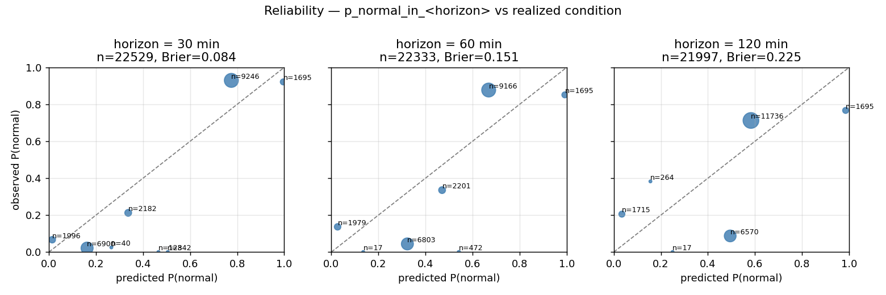
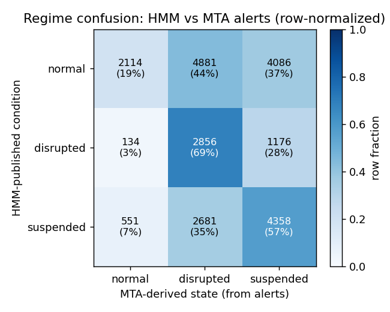
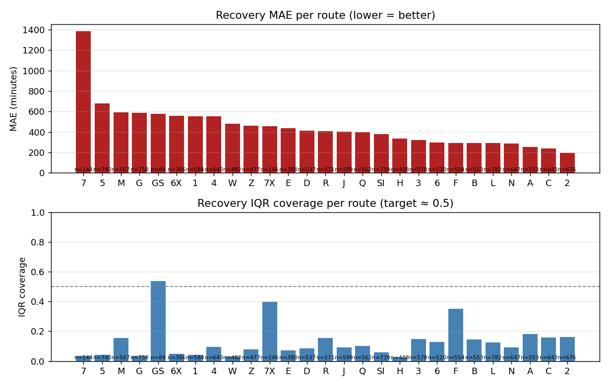
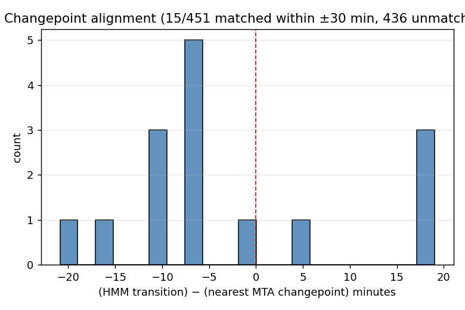

# HMM shadow-log validation review — 2026-05-17

**Verdict: NO-GO.** Do not graduate `route_status[].inference` to a stable
surface. Recalibration of the per-route HMM and a rethink of the recovery
estimator are required first.

## Data window

| | |
|--|--|
| Window | 2026-05-13 .. 2026-05-17 UTC (5 days) |
| Predictions  | 22,837 across 28 routes |
| Transitions  | 451 |
| MTA alert ground-truth ticks | 41,676 |
| Source | `v1/predictions/<date>/*.jsonl`, `v1/regime_transitions/<date>/*.jsonl`, `archive/alerts/<date>/*.json` |

Reproduce with `PYTHONPATH=. murk exec -- .venv/bin/python -m training.review --days 5`.

## Findings

### 1. Calibration — bad above 30 min

| horizon | n | Brier |
|--------:|--:|------:|
| 30 min | 22,529 | **0.084** |
| 60 min | 22,333 | **0.151** |
| 120 min | 21,997 | **0.225** |

Reliability shape is consistent across horizons: the model is **underconfident**
at the top end (predicts ~0.78 → realized ~0.93) and **overconfident** at the
mid-range (predicts ~0.50 → realized ~0.0). The 30-min horizon is borderline
acceptable; 60 and 120 min are unusable.

### 2. Regime confusion vs MTA alerts — poor

Reading the rows: when the HMM says `normal`, only **19%** of those ticks have
no MTA alert. When it says `suspended`, only **57%** correspond to a
MTA-suspension alert (35% are MTA-disrupted). The HMM is detecting a different
signal than the published alert state — and the deviation isn't a lag, it's a
substantive mismatch (see §4).

### 3. Recovery prediction — essentially noise

| | overall | worst routes |
|---|---|---|
| MAE  | **416 min** | 7: 1387, 5: 681, M: 594, G: 589, GS: 580 |
| RMSE | 787 min | |
| IQR coverage | **11.4%** | target 50% |

Per-route MAE ranges from 198 min (2 train) to 1387 min (7 train). IQR
coverage (the fraction of predictions whose [low, high] band contained the
realized remaining-time) sits at 3–18% for every route except GS (54%, n=84).
The published `recovery_minutes_low/high` are not credible interval estimates
right now.

### 4. Changepoint alignment — disjoint from MTA events

Of 451 HMM regime transitions, only **15** (3.3%) had a matching MTA-state
changepoint within ±30 min. The HMM is changing regime on dynamics inside its
own observation stream that don't correspond to alert posting/clearing events.
This is consistent with the confusion-matrix result.

## Implications for graduation

Recommendation per inference field:

| field | recommendation | reason |
|---|---|---|
| `condition`, `is_disrupted` | **hold** | 19% agreement when HMM says normal; users would see ~80% false flags |
| `p_normal`, `p_disrupted`, `p_suspended` | **hold** | mid-range probabilities are anti-calibrated |
| `p_normal_in_30min` | **conditional** | Brier 0.084, acceptable, but consumers can't rely on the higher horizons being similar |
| `p_normal_in_60min`, `p_normal_in_120min` | **hold** | Brier ≥ 0.15; clearly miscalibrated curve |
| `recovery_minutes` (+ `_low`, `_high`) | **hold** | MAE 7 hours, IQR coverage 11%; not a credible interval |
| `regime_entered_at`, `regime_age_seconds` | **possible** | not directly tested here, but they're descriptive not predictive |
| `recovery_indeterminate`, `model_warming_up` | **possible** | metadata flags, low risk |

## Suggested next steps

1. Recalibrate the per-route HMM (see follow-up issue) — empirical-Bayes
   anchoring may be over-shrinking emissions toward the corpus prior, producing
   the underconfidence we see at high `p_normal`. The mid-range overconfidence
   suggests the disrupted state's emission distribution is too broad.
2. Redesign the recovery estimator (see follow-up issue) — the current dwell
   geometry (`expected_dwell_ticks` from the self-loop probability) cannot
   express bimodal recovery distributions and saturates at the clamp ceiling
   for any route with a high self-loop. Consider per-route empirical
   recovery-time distributions from the transition stream itself.
3. Add planned-work as a separate ground-truth axis in the confusion matrix
   (it's currently lumped with "disrupted") and re-run after both fixes land.
4. Re-run this review every 14 days as data accumulates; promote `eval.json`
   refresh to a scheduled job so the public surface isn't stale.

## Artifacts

- `summary.json` — machine-readable rollup (counts, calibration, recovery,
  confusion, changepoint alignment)
- `reliability.png`, `confusion.png`, `recovery_by_route.png`,
  `changepoint_alignment.png`
