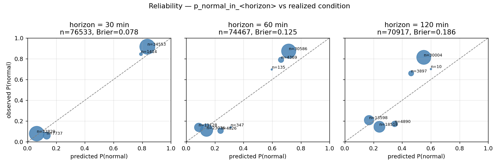
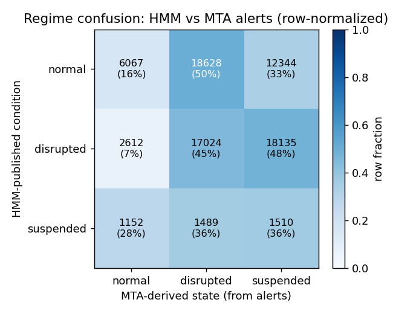
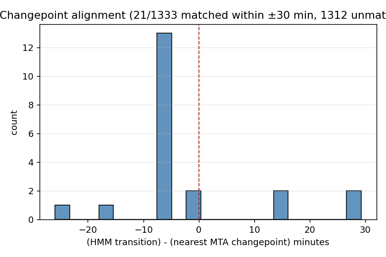
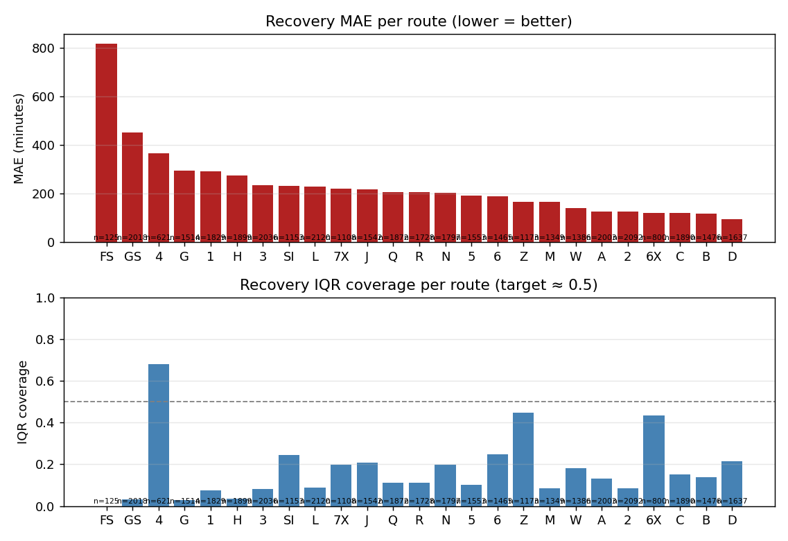

# HMM shadow-log validation review — 2026-06-03

**Verdict: NO-GO (improving).** Do not yet graduate the full
`route_status[].inference` surface to a stable contract. The compounding
outage that invalidated the 2026-05-17 review is gone, and this is the first
*fair* test of the trained HMM. Recovery point error roughly halved and
calibration improved at every horizon — but the recovery intervals, the
saturated posteriors, and regime alignment with MTA state are still blockers.

This re-run closes the question raised by momentarily-s76: the earlier NO-GO
was measuring a broken pipeline, not the model. The model on its merits is
better, but not graduate-ready.

## Data window

| | |
|--|--|
| Window | 2026-05-21 .. 2026-06-03 UTC (14 days) |
| Predictions | 78,961 across all routes |
| Transitions | 1,333 |
| MTA alert ground-truth ticks | 102,772 |
| Source | `v1/predictions/<date>/*.jsonl`, `v1/regime_transitions/<date>/*.jsonl`, `archive/alerts/<date>/*.json` |

Reproduce with `murk exec -- uv run python -m training.review --days 14`.

## What changed vs the 2026-05-17 NO-GO

| metric | 2026-05-17 (broken) | 2026-06-03 (trained) |
|---|---|---|
| Brier 30 / 60 / 120 min | 0.084 / 0.151 / 0.225 | **0.078 / 0.125 / 0.186** |
| Recovery MAE | 416 min | **211 min** |
| Recovery RMSE | 787 min | **322 min** |
| Recovery IQR coverage | 11.4% | 15.0% |

Fixing the cron / training / EM-degeneracy outage delivered most of the
recovery-error improvement. Calibration improved but the *shape* of the
problems is unchanged.

## Findings

### 1. Calibration — good at 30 min, still overconfident

| horizon | n | Brier | weighted reliability gap |
|--------:|--:|------:|------:|
| 30 min | 76,533 | **0.078** | 0.051 |
| 60 min | 74,467 | 0.125 | 0.099 |
| 120 min | 70,917 | 0.186 | 0.167 |

The 30-min nowcast is genuinely good. But only **4 of 10** probability bins
are occupied at 30 min — the posteriors saturate to ~0/1 (live snapshot shows
`p_disrupted = 1.0`, `p_normal = 1.8e-16`). The argmax is mostly right, but the
probabilities are not usable as probabilities. Reliability gap grows with
horizon (0.05 → 0.17), so anything past the 30-min nowcast is not trustworthy.

### 2. Regime confusion vs MTA alerts — poor agreement

Rows = HMM state, columns = MTA truth (precision = diagonal / row):

| HMM says | → normal | → disrupted | → suspended | precision |
|---|--:|--:|--:|--:|
| normal | 6,067 | 18,628 | 12,344 | **16.4%** |
| disrupted | 2,612 | 17,024 | 18,135 | 45.1% |
| suspended | 1,152 | 1,489 | 1,510 | 36.4% |

Recall: normal 61.7%, disrupted 45.8%, **suspended 4.7%**. The HMM misses 95%
of MTA-suspension ticks, and when it says `normal` the MTA has an active alert
84% of the time. Caveat: MTA "truth" counts *any* alert (incl. planned work and
minor delays) as disrupted/suspended, so some disagreement is the HMM
reasonably treating planned work as normal — but the 4.7% suspended recall is a
real miss, not a taxonomy artifact.

### 3. Changepoint alignment — HMM regime changes don't track MTA

Only **21 of 1,333** HMM regime changes (1.6%) fall within 30 min of an MTA
alert state change (median |Δ| = 5.9 min for those that do match). The HMM is
changing state on a signal largely decoupled from MTA's published transitions.

### 4. Recovery prediction — point estimate much better, intervals still not credible

| | overall | worst routes | best routes |
|---|---|---|---|
| MAE | **211 min** | FS 818, GS 454, 4: 365, G 294 | D 96, B 119, C 121 |
| RMSE | 322 min | | |
| IQR coverage | **15.0%** | (target 50%) | |

Point error halved vs May-17, but `recovery_minutes_low/high` still contain the
realized remaining-time only 15% of the time — the bands are far too narrow,
and inconsistently so (route 4 is *over*-wide at 68% coverage). Shuttles and
low-frequency / planned-work-dominated lines (FS, GS, G) are worst.

## Recommendation

Graduating requires, in priority order:

1. **Recovery interval calibration** (IQR coverage 15% → ~50%) — momentarily-alu
   (per-(route, state, alert_type) dwell quantiles; Phase 1 data capture is
   already landed).
2. **De-saturate the posteriors** — stickier transition prior / emission
   temperature so mid-range probabilities exist and mean something.
3. **Suspended-state recall** (4.7%) — revisit the suspended emission params or
   accept the HMM models a different latent than MTA's alert taxonomy and
   reframe what is published.
4. **Route-1-disrupted-with-no-alerts** consistency — momentarily-13j.

The 30-min `condition` nowcast (Brier 0.078) is the one piece close to
graduate-able; the probabilities and `recovery_minutes` bands are not.
